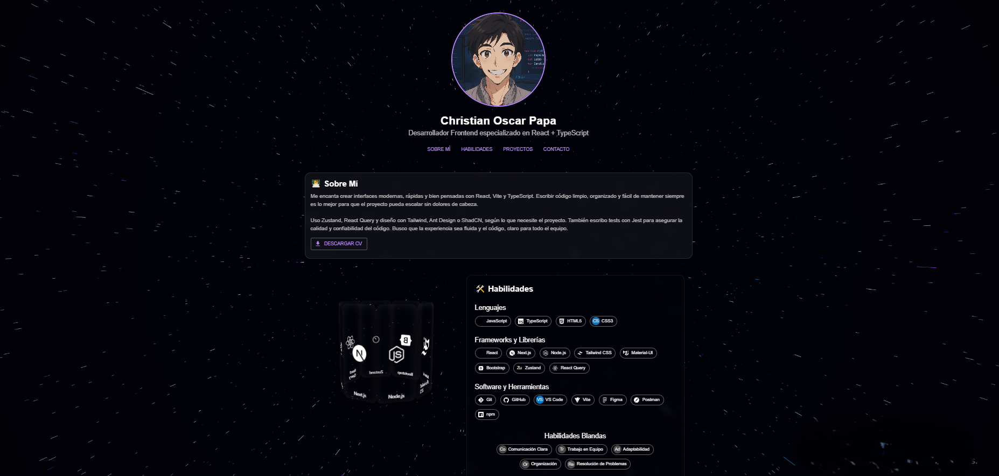

# 🌌 Mi CV Futurista: Un Portfolio Interactivo 3D con React & Three.js

¡Bienvenido a mi portfolio personal! 🚀

Esta aplicación web de una sola página está diseñada para mostrar mi perfil profesional, habilidades y proyectos de una manera **inmersiva, dinámica y visualmente impactante**.

Construida con las últimas tecnologías de frontend y gráficos 3D, ofrece una experiencia única que va más allá de un CV tradicional.



---

## ✨ Características Destacadas

- **💻 Stack de Vanguardia:** React, Vite, TypeScript, Three.js, y Material-UI.
- **🚀 Experiencia 3D Interactiva:**
  - **Fondo de Hipervelocidad:** Un impresionante efecto visual de "warp speed" que te sumerge en el espacio.
  - **Octaedro Interactivo de Habilidades:** Explora mis hard skills en un prisma 3D dinámico y giratorio.
- **🛠️ Sección de Habilidades Mejorada:** Habilidades categorizadas y presentadas con iconos dinámicos para una visión clara de mi expertise.
- **📱 Diseño Responsivo:** Adaptado para una visualización óptima en desktop, tablet y mobile.
- **✨ Animaciones Fluidas:** Transiciones suaves y efectos de hover que enriquecen la interacción del usuario.
- **🔧 Componentes Modulares:** Estructura de código limpia y organizada para facilitar el mantenimiento y la escalabilidad.

---

## 🚀 Tecnologías Clave

| Categoría | Tecnologías |
|---|---|
| **Framework** | [React](https://react.dev/) |
| **Gráficos 3D** | [Three.js](https://threejs.org/), [@react-three/fiber](https://docs.pmnd.rs/react-three-fiber/getting-started/introduction), [@react-three/drei](https://docs.pmnd.rs/drei/introduction) |
| **Bundler** | [Vite](https://vitejs.dev/) |
| **Lenguaje** | [TypeScript](https://www.typescriptlang.org/) |
| **UI/UX** | [Material-UI (MUI)](https://mui.com/), [Emotion](https://emotion.sh/docs/introduction) |
| **Animación** | [Framer Motion](https://www.framer.com/motion/) |
| **Testing** | [Jest](https://jestjs.io/) + [React Testing Library](https://testing-library.com/docs/react-testing-library/intro/) |

---

## 📂 Estructura del Proyecto

```
mi-cv-futurista/
├── public/             # Archivos estáticos (imágenes, PDFs)
├── src/
│   ├── components/     # Componentes reutilizables de React
│   ├── data/           # Datos estáticos (ej. skills)
│   ├── layout/         # Componentes de maquetación (ej. Body)
│   ├── App.tsx         # Componente principal de la aplicación
│   ├── main.tsx        # Punto de entrada de la aplicación
│   └── index.css       # Estilos globales
├── vite.config.ts      # Configuración de Vite
├── jest.config.js      # Configuración de Jest
└── package.json        # Dependencias y scripts del proyecto
```

---

## 🛠️ Instalación & Ejecución Local

```bash
# Clona el repositorio
git clone https://github.com/tu-usuario/tu-repositorio.git
cd tu-repositorio

# Instala dependencias
npm install

# Ejecuta la app en modo desarrollo
npm run dev
```
